# Digital Marketplace Backend - API Endpunkte Übersicht

## Controller Overview
Das Backend verfügt über 11 Controller mit verschiedenen API-Endpunkten:

```mermaid
graph TD
    A["Digital Marketplace Backend API"] --> B["/api/admin - AdminController"]
    A --> C["/api/auctions - AuctionController"]
    A --> D["/api/categories - CategoryController"]
    A --> E["/api/health - HealthController"]
    A --> F["/api/images - ImageController"]
    A --> G["/api/images/reactions - ImageReactionController"]
    A --> H["/api/notifications - NotificationController"]
    A --> I["/api/transactions - TransactionController"]
    A --> J["/api/users - UserController"]
    A --> K["/api/webhooks - WebhookController"]
    
    B --> B1["GET /dashboard - Dashboard Statistiken"]
    B --> B2["GET /analytics - Platform Analytics"]
    B --> B3["GET /users - Alle Benutzer"]
    B --> B4["GET /users/{id} - Benutzer Details"]
    B --> B5["PUT /users/{id} - Benutzer bearbeiten"]
    B --> B6["POST /users/{id}/suspend - Benutzer sperren"]
    B --> B7["POST /users/{id}/reactivate - Benutzer reaktivieren"]
    B --> B8["GET /images - Alle Bilder"]
    B --> B9["POST /images/{id}/feature - Bild hervorheben"]
    B --> B10["DELETE /images/{id} - Bild löschen"]
    B --> B11["GET /transactions - Alle Transaktionen"]
    B --> B12["POST /transactions/{id}/refund - Admin Rückerstattung"]
    B --> B13["GET /reports - Alle Reports"]
    B --> B14["PUT /reports/{id} - Report Status ändern"]
    B --> B15["GET /settings - System Einstellungen"]
    B --> B16["PUT /settings - System Einstellungen ändern"]
    B --> B17["GET /audit-logs - Audit Logs"]
    
    C --> C1["GET / - Alle Auktionen"]
    C --> C2["GET /{id} - Auktion Details"]
    C --> C3["POST / - Neue Auktion erstellen"]
    C --> C4["POST /{id}/bid - Gebot abgeben"]
    C --> C5["PUT /{id} - Auktion bearbeiten"]
    C --> C6["DELETE /{id} - Auktion löschen"]
    C --> C7["POST /{id}/end - Auktion beenden"]
    
    D --> D1["GET / - Alle aktiven Kategorien"]
    D --> D2["GET /{id} - Kategorie Details"]
    D --> D3["GET /tree - Kategorie Hierarchie"]
    D --> D4["GET /{id}/images - Bilder einer Kategorie"]
    D --> D5["POST / - Neue Kategorie erstellen"]
    D --> D6["PUT /{id} - Kategorie bearbeiten"]
    D --> D7["DELETE /{id} - Kategorie löschen"]
    
    E --> E1["GET / - System Status"]
    E --> E2["GET /db - Datenbank Status"]
    E --> E3["GET /external - Externe Services Status"]
    
    F --> F1["GET / - Öffentliche Bilder"]
    F --> F2["POST /search - Bilder suchen"]
    F --> F3["GET /{id} - Bild Details"]
    F --> F4["POST / - Bild hochladen"]
    F --> F5["PUT /{id} - Bild bearbeiten"]
    F --> F6["DELETE /{id} - Bild löschen"]
    F --> F7["GET /{id}/download - Bild herunterladen"]
    F --> F8["GET /my - Eigene Bilder"]
    F --> F9["GET /purchased - Gekaufte Bilder"]
    F --> F10["GET /trending - Trending Bilder"]
    F --> F11["GET /featured - Hervorgehobene Bilder"]
    
    G --> G1["POST /{id}/like - Bild liken"]
    G --> G2["DELETE /{id}/like - Like entfernen"]
    G --> G3["POST /{id}/favorite - Zu Favoriten hinzufügen"]
    G --> G4["DELETE /{id}/favorite - Aus Favoriten entfernen"]
    G --> G5["GET /my/likes - Meine Likes"]
    G --> G6["GET /my/favorites - Meine Favoriten"]
    
    H --> H1["GET / - Alle Benachrichtigungen"]
    H --> H2["GET /unread - Ungelesene Benachrichtigungen"]
    H --> H3["PUT /{id}/read - Benachrichtigung als gelesen markieren"]
    H --> H4["PUT /mark-all-read - Alle als gelesen markieren"]
    H --> H5["DELETE /{id} - Benachrichtigung löschen"]
    
    I --> I1["GET / - Alle Transaktionen"]
    I --> I2["GET /{id} - Transation Details"]
    I --> I3["POST / - Neue Transaktion erstellen"]
    I --> I4["POST /{id}/confirm - Transaktion bestätigen"]
    I --> I5["POST /{id}/cancel - Transaktion stornieren"]
    I --> I6["POST /{id}/refund - Rückerstattung beantragen"]
    I --> I7["GET /sales - Verkäufe"]
    I --> I8["GET /purchases - Käufe"]
    I --> I9["GET /analytics - Transaktions-Analytics"]
    
    J --> J1["GET /me - Eigenes Profil"]
    J --> J2["PUT /me - Profil bearbeiten"]
    J --> J3["GET /{id} - Benutzer Profil"]
    J --> J4["GET /{id}/images - Benutzer Bilder"]
    J --> J5["POST /follow/{id} - Benutzer folgen"]
    J --> J6["DELETE /follow/{id} - Entfolgen"]
    J --> J7["GET /following - Gefolgte Benutzer"]
    J --> J8["GET /followers - Follower"]
    J --> J9["GET /seller-stats - Verkäufer Statistiken"]
    
    K --> K1["POST /stripe - Stripe Webhook"]
    K --> K2["POST /paypal - PayPal Webhook"]
```

## API Endpunkte nach Funktionsbereichen

### 🔐 Admin Bereich (/api/admin) - Nur für Administratoren
**Erfordert ADMIN Rolle**

| Method | Endpoint | Beschreibung | Parameter |
|--------|----------|--------------|-----------|
| GET | /dashboard | Dashboard Statistiken | - |
| GET | /analytics | Platform Analytics | fromDate, toDate |
| GET | /users | Alle Benutzer mit Filtern | status, role, search, pageable |
| GET | /users/{userId} | Detaillierte Benutzerinformationen | userId |
| PUT | /users/{userId} | Benutzer Details aktualisieren | userId, AdminUserUpdateRequest |
| POST | /users/{userId}/suspend | Benutzer Account sperren | userId, reason |
| POST | /users/{userId}/reactivate | Gesperrten Benutzer reaktivieren | userId |
| GET | /images | Alle Bilder mit Filtern | status, uploaderId, search, pageable |
| POST | /images/{imageId}/feature | Bild hervorheben/verstecken | imageId, featured |
| DELETE | /images/{imageId} | Bild löschen (Admin Override) | imageId, reason |
| GET | /transactions | Alle Transaktionen mit Filtern | status, userId, fromDate, toDate, pageable |
| POST | /transactions/{transactionId}/refund | Admin Rückerstattung verarbeiten | transactionId, reason, amount |
| GET | /reports | Alle Content Reports | status, type, pageable |
| PUT | /reports/{reportId} | Report Status aktualisieren | reportId, status, resolution |
| GET | /settings | System Einstellungen abrufen | - |
| PUT | /settings | System Einstellungen aktualisieren | settings |
| GET | /audit-logs | Audit Logs abrufen | action, userId, fromDate, toDate, pageable |

### 🏷️ Kategorien (/api/categories)

| Method | Endpoint | Beschreibung | Auth |
|--------|----------|--------------|------|
| GET | / | Alle aktiven Kategorien | Public |
| GET | /{categoryId} | Kategorie Details | Public |
| GET | /tree | Kategorie Hierarchie | Public |
| GET | /{categoryId}/images | Bilder einer Kategorie | Public |
| POST | / | Neue Kategorie erstellen | Admin |
| PUT | /{categoryId} | Kategorie bearbeiten | Admin |
| DELETE | /{categoryId} | Kategorie löschen | Admin |

### 🖼️ Bilder (/api/images)

| Method | Endpoint | Beschreibung | Auth |
|--------|----------|--------------|------|
| GET | / | Öffentliche Bilder mit Pagination | Public |
| POST | /search | Bilder mit Filtern suchen | Public |
| GET | /{imageId} | Bild Details abrufen | Public/User |
| POST | / | Neues Bild hochladen | Seller |
| PUT | /{imageId} | Bild Details bearbeiten | Owner |
| DELETE | /{imageId} | Bild löschen | Owner |
| GET | /{imageId}/download | Bild herunterladen | Purchaser |
| GET | /my | Eigene hochgeladene Bilder | User |
| GET | /purchased | Gekaufte Bilder | User |
| GET | /trending | Trending Bilder | Public |
| GET | /featured | Hervorgehobene Bilder | Public |

### ❤️ Bild Reaktionen (/api/images/reactions)

| Method | Endpoint | Beschreibung | Auth |
|--------|----------|--------------|------|
| POST | /{imageId}/like | Bild liken | User |
| DELETE | /{imageId}/like | Like entfernen | User |
| POST | /{imageId}/favorite | Zu Favoriten hinzufügen | User |
| DELETE | /{imageId}/favorite | Aus Favoriten entfernen | User |
| GET | /my/likes | Meine gelikten Bilder | User |
| GET | /my/favorites | Meine Favoriten | User |

### 👤 Benutzer (/api/users)

| Method | Endpoint | Beschreibung | Auth |
|--------|----------|--------------|------|
| GET | /me | Eigenes Profil abrufen | User |
| PUT | /me | Eigenes Profil bearbeiten | User |
| GET | /{userId} | Öffentliches Benutzer Profil | Public |
| GET | /{userId}/images | Bilder eines Benutzers | Public |
| POST | /follow/{userId} | Benutzer folgen | User |
| DELETE | /follow/{userId} | Benutzer entfolgen | User |
| GET | /following | Gefolgte Benutzer | User |
| GET | /followers | Eigene Follower | User |
| GET | /seller-stats | Verkäufer Statistiken | Seller |

### 💰 Transaktionen (/api/transactions)

| Method | Endpoint | Beschreibung | Auth |
|--------|----------|--------------|------|
| GET | / | Alle eigenen Transaktionen | User |
| GET | /{transactionId} | Transaktions Details | User |
| POST | / | Neue Transaktion erstellen | User |
| POST | /{transactionId}/confirm | Transaktion bestätigen | User |
| POST | /{transactionId}/cancel | Transaktion stornieren | User |
| POST | /{transactionId}/refund | Rückerstattung beantragen | User |
| GET | /sales | Eigene Verkäufe | Seller |
| GET | /purchases | Eigene Käufe | User |
| GET | /analytics | Transaktions Analytics | Seller |

### 🔔 Benachrichtigungen (/api/notifications)

| Method | Endpoint | Beschreibung | Auth |
|--------|----------|--------------|------|
| GET | / | Alle Benachrichtigungen | User |
| GET | /unread | Ungelesene Benachrichtigungen | User |
| PUT | /{notificationId}/read | Als gelesen markieren | User |
| PUT | /mark-all-read | Alle als gelesen markieren | User |
| DELETE | /{notificationId} | Benachrichtigung löschen | User |

### 🏥 System Health (/api/health)

| Method | Endpoint | Beschreibung | Auth |
|--------|----------|--------------|------|
| GET | / | System Status | Public |
| GET | /db | Datenbank Status | Public |
| GET | /external | Externe Services Status | Public |

### 🎯 Auktionen (/api/auctions)

| Method | Endpoint | Beschreibung | Auth |
|--------|----------|--------------|------|
| GET | / | Alle Auktionen | Public |
| GET | /{auctionId} | Auktion Details | Public |
| POST | / | Neue Auktion erstellen | Seller |
| POST | /{auctionId}/bid | Gebot abgeben | User |
| PUT | /{auctionId} | Auktion bearbeiten | Owner |
| DELETE | /{auctionId} | Auktion löschen | Owner |
| POST | /{auctionId}/end | Auktion beenden | Owner |

### 🔗 Webhooks (/api/webhooks)

| Method | Endpoint | Beschreibung | Auth |
|--------|----------|--------------|------|
| POST | /stripe | Stripe Payment Webhook | System |
| POST | /paypal | PayPal Payment Webhook | System |

## Berechtigungsebenen

- **Public**: Keine Authentifizierung erforderlich
- **User**: Authentifizierung als registrierter Benutzer erforderlich
- **Seller**: Benutzer mit Verkäufer-Rolle
- **Admin**: Administrator-Berechtigung erforderlich
- **Owner**: Nur der Besitzer der Ressource
- **Purchaser**: Benutzer, der das Bild gekauft hat
- **System**: Interne System-Calls (Webhooks)

## Hinweise

1. **AuthController** ist derzeit auskommentiert - Authentifizierung wird wahrscheinlich über einen anderen Mechanismus gehandhabt
2. Alle Controller verwenden CORS mit `origins = "*", maxAge = 3600`
3. Die meisten Endpunkte verwenden `@CurrentUser UserPrincipal` für Benutzerauthentifizierung
4. Pagination wird über Spring's `Pageable` Interface gehandhabt
5. Validierung erfolgt über Jakarta Validation (`@Valid`)
